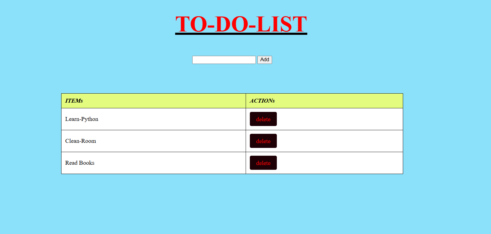

# TODO- Python Flask 

This is a very basic version of TO-DO-LIST webapp,developed using Python Flask. We have not used database but a simple list to store items.Done it for learning flask basics


## Installing Flask

Run the following in the terminal to install the Python and Flask library.

```pip install python```

```pip install Flask```

## Prerequisite

    Python
    Flask

## To Know more refer it
[Flask Documentation](https://flask.palletsprojects.com/en/stable/)
